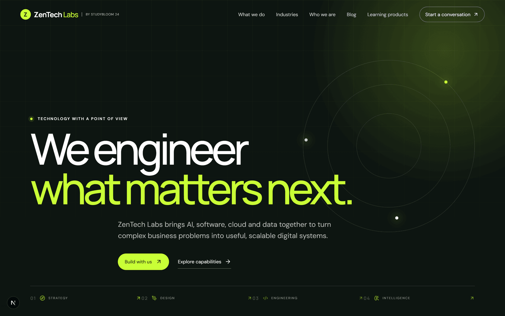
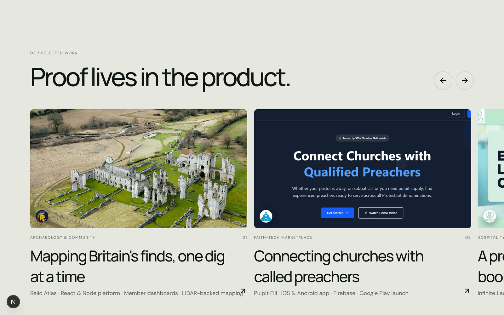
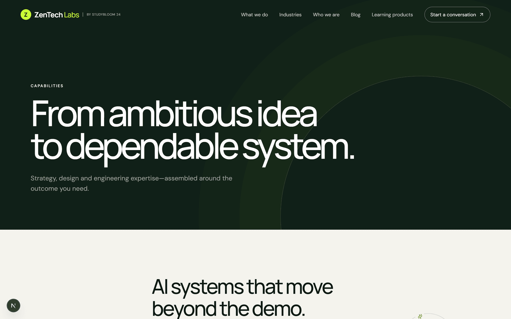
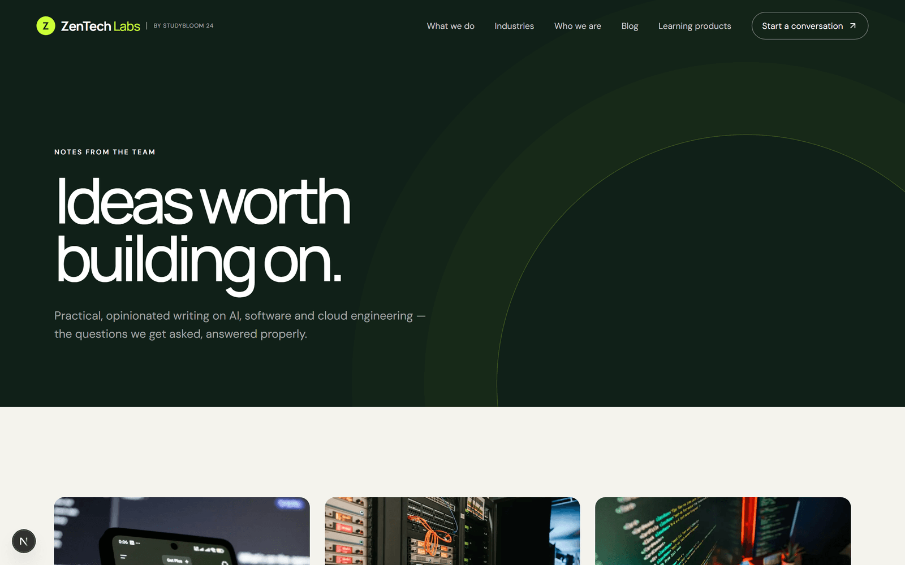

# ZenTech Labs

**AI, software and cloud engineering studio website** — built with Next.js 16, React 19 and TypeScript.

🔗 **Live site:** [zentechlabs.gyanoda.com](https://zentechlabs.gyanoda.com)

A venture of Studybloom 24 LLP. *(Gyanoda Courses and the Gyanoda app are a separate education product — not part of this repo.)*

<br/>



<br/>

## Features

- **Animated, story-driven homepage** — a sticky-pinned services section that cycles through capabilities as you scroll, a horizontally-scrolling portfolio carousel with a cursor-following reveal effect, a 3D-tilt concepts grid, and a scroll-triggered "How we work" process section.
- **Real portfolio, real screenshots** — every project shown in "Selected work" is an actual product, not a mockup.
- **Full blog** with individually generated Open Graph share images per post (`next/og`), JSON-LD `Article` structured data, and a working share-to-X/LinkedIn/copy-link component.
- **A working contact system**, not a `mailto:` link — a serverless API route sends the enquiry over real SMTP, auto-replies to the visitor so they know it went through, and logs every submission to Postgres.
- **A protected admin panel** (`/admin`) listing every enquiry ever received, gated by HTTP Basic Auth via middleware.
- **SEO done properly** — per-page Open Graph/Twitter metadata (not just inherited from the homepage), a dynamic sitemap and robots.txt, Organization structured data, and generated favicons.

<br/>



<br/>

## Tech stack

| | |
|---|---|
| **Framework** | [Next.js 16](https://nextjs.org) (App Router, Turbopack) |
| **UI** | React 19, TypeScript, hand-written CSS (no UI framework) |
| **Icons** | [lucide-react](https://lucide.dev) |
| **Email** | [Nodemailer](https://nodemailer.com) over standard SMTP — no third-party email API |
| **Database** | [Neon](https://neon.tech) serverless Postgres, via `@neondatabase/serverless` |
| **Images** | `next/image`, `next/og` for dynamically generated share images |
| **Hosting** | [Vercel](https://vercel.com) |

<br/>



<br/>

## Getting started

```bash
npm install
cp .env.example .env.local   # then fill in real values, see below
npm run dev
```

Open [http://localhost:3000](http://localhost:3000).

### Environment variables

Copy `.env.example` to `.env.local` and fill these in — see the comments in that file for exactly where each one comes from.

| Variable | Purpose |
|---|---|
| `SMTP_HOST` / `SMTP_PORT` / `SMTP_USER` / `SMTP_PASS` | The mailbox that sends contact-form emails |
| `SMTP_FROM` | Optional — sender address shown to recipients, if different from `SMTP_USER` |
| `CONTACT_TO_EMAIL` | Where enquiries are delivered |
| `DATABASE_URL` | Postgres connection string (Neon) — powers `/admin` |
| `ADMIN_USER` / `ADMIN_PASSWORD` | Login for the `/admin` enquiries panel |

None of these are required for the site itself to run — without them, the contact form and admin panel degrade gracefully rather than crashing (the form shows a clear "not configured" message instead of failing silently).

<br/>



<br/>

## Project structure

```
app/
  page.tsx                  Homepage
  services/ industries/ company/ contact/
  blog/                     Blog index, [slug] posts, generated OG images
  admin/                    Enquiries panel (protected)
  api/contact/route.ts      Contact form backend (SMTP + Postgres)
  api/admin/enquiries/      Admin data endpoint
  opengraph-image.tsx       Homepage share image
  sitemap.ts  robots.ts  manifest.ts
components/                 Reusable UI (Header, Footer, WorkShowcase, ProcessSteps, Faq, …)
lib/
  site.ts                   Site-wide config + shared metadata helper
  blog.ts                   Blog post content
  db.ts                     Postgres access for the admin panel
middleware.ts                Basic Auth gate for /admin
```

## Deployment

Deployed on Vercel. In the project's **Storage** tab, add the **Neon** integration to provision Postgres automatically (`DATABASE_URL` gets set for you — nothing to copy by hand). Add the SMTP and admin credentials from `.env.example` as regular environment variables in the Vercel dashboard.

---

© Studybloom 24 LLP · [zentechlabs.gyanoda.com](https://zentechlabs.gyanoda.com)
